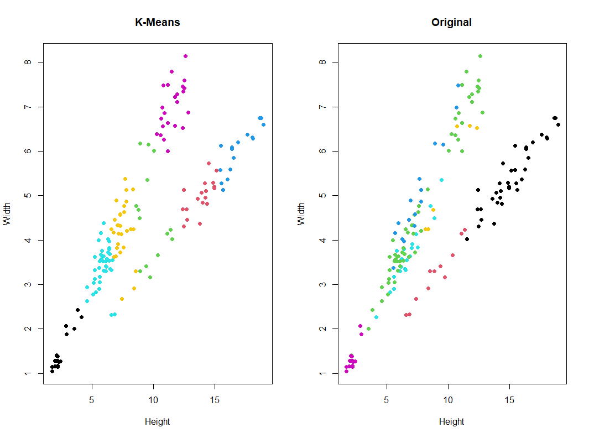

# Tugas Besar Pembelajaran Mesin (K-Means) 
Pada tugas ini kami akan menyelesaikan masalah clustering menggunakan metode k-means pada dataset ikan. Akan dibahas juga mengenai perbandingan antara data asli dengan hasil k-means melalui sebuah plot dan juga temuan-temuan lainnya. Ditampilkan juga kode beserta outputnya. Untuk yang ingin melihat kodenya secara utuh bisa cek di [Github](https://github.com/AchmadNoer/tubes_K-Means) berikut dengan file bernama `Classify Fish with K-Means.R`.


## Data
Data yang digunakan dalam kasus clustering ini adalah dataset ikan yang didapatkan dari situs [Kaggle](https://www.kaggle.com/datasets) dengan kata kunci [Fish Market](https://www.kaggle.com/aungpyaeap/fish-market) berformat csv.  Di dalamnya terdapat kolom spesies ikan dan berbagai macam ukuran dalam satuan centimeter.
Untuk memuatnya ke dalam RStudio dapat menggunakan kode `read.csv()` seperti pada baris ke-1.

```{r message=FALSE, warning=FALSE, attr.source = ".numberLines"}
dataIkan <- read.csv("Ikan.csv", stringsAsFactors=TRUE, fileEncoding="UTF-8-BOM")
```

Dari dataset ikan yang digunakan untuk clustering sebagai variabelnya akan dipilih 2 saja yaitu data `Width` dan `Height`. Pemilihan parameter ini setelah didiskusikan, dirasa cukup sebagai parameter yang mewakili dari masing-masing spesies ikan.

```{r message=FALSE, warning=FALSE, attr.source = ".numberLines"}
dataIkan.ciri <- dataIkan[, 6:7]
dataIkan.jenis <- dataIkan[, "Species"]
set.seed(62)
hasilKMeans <- kmeans(dataIkan.ciri, 7)
```

Pada baris ke-4, telah ditentukan bahwa dari fungsi `kmeans` akan mencari 7 cluster dari dataset ikan dengan 2 variabel yang sudah ditentukan tadi. Tujuh disini maksudnya adalah 7 spesies ikan karena sesuai dengan jumlah spesies ikan di dataset. Selanjutnya, hasil clustering dari fungsi `kmeans` akan divisualisasikan sehingga dapat dibandingkan dengan data aslinya.

Sebelum masuk ke plotting, ada tahap yang berfungsi untuk mengevaluasi cost function atau yang disebut sebagai distortion function. Di sini nilai distortion pada iterasi terakhir dapat dilihat melalui `tot.withinss`.

```{r message=FALSE, warning=FALSE, attr.source = ".numberLines"}
hasilKMeans$tot.withinss
```

## Visualisasi Data

```{r message=FALSE, warning=FALSE, attr.source = ".numberLines"}
par(mfrow=c(1,2))
plot(dataIkan.ciri, col = hasilKMeans$cluster, main="K-Means")
plot(dataIkan.ciri, col = dataIkan.jenis, main="Original")
```


Plot sebelah kiri adalah hasil clustering menggunakan fungsi `kmeans`, sedangkan plot sebelah kanan adalah plot dataset spesies ikan berdasarkan dua variabel yaitu `Height` dan `Width`. 

Perhatikan dua plot diatas, dapat dilihat bahwa hasil clustering merepresentasikan kelompok spesies dengan cukup bagus apabila dibandingkan dengan plot dari data aslinya. Tujuh spesies direpresentasikan dengan warna yang berbeda-beda. Walaupun urutan warna yang tidak sama pada hasil clustering (plot kiri) dengan data aslinya (plot kanan), hal tersebut tidak menjadi masalah.

Di bawah ini, kita akan memvisualisasikan hasil clustering di atas, menggunakan package `ggplot2`. 

Baris ke-4 hingga ke-6 adalah plotting menggunakan `ggplot2`. Pada bagian ini akan diberikan efek radius atau jangkauan untuk masing-masing clusternya. 

```{r message=FALSE, warning=FALSE, attr.source = ".numberLines"}
dataIkan.ciri$cluster <- factor(hasilKMeans$cluster)
centers <- as.data.frame(hasilKMeans$centers)

library("ggplot2")
ggplot() + 
  geom_point(data = dataIkan.ciri, aes(x = Height, y = Width, color = cluster)) + 
  geom_point(data = centers, aes(x = Height, y = Width, color = "Center"), 
             size = 30, alpha = 0.2, show.legend = FALSE)
```
